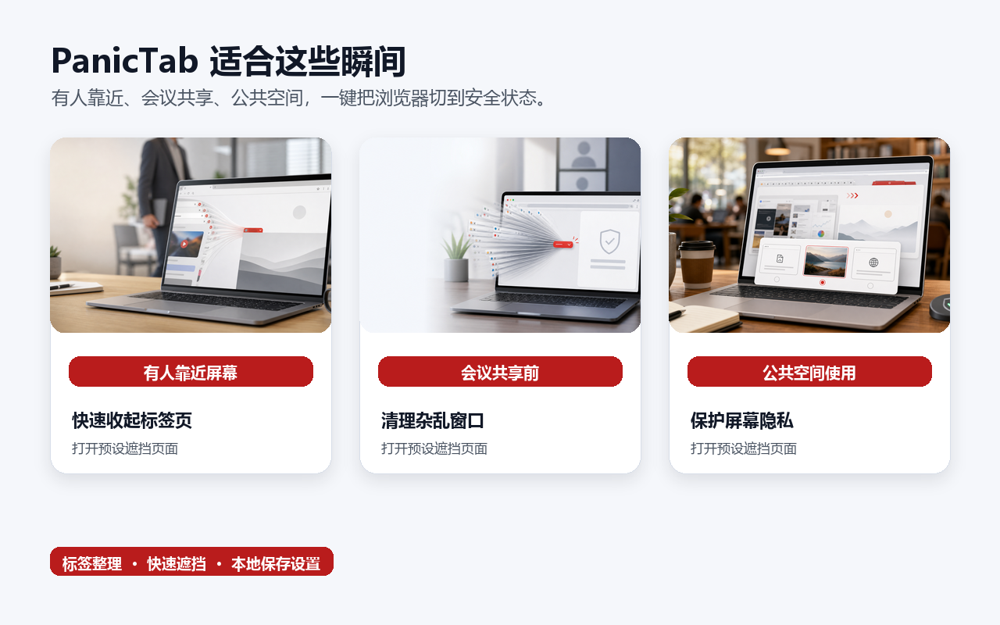
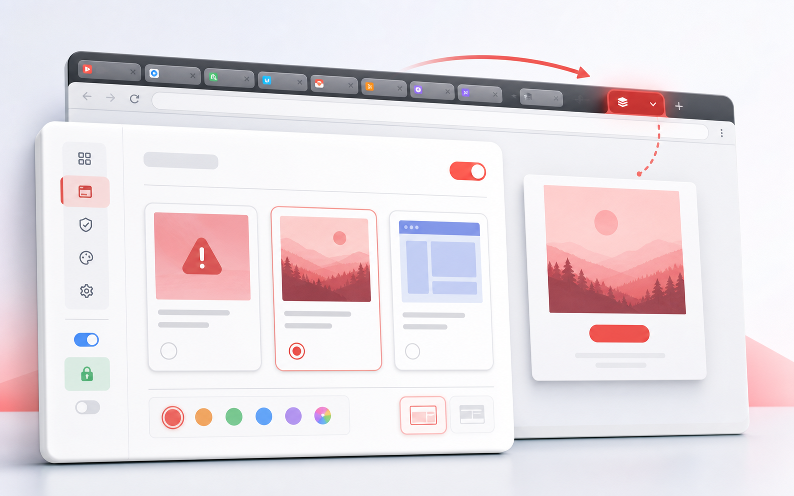

# PanicTab

> 面向屏幕共享、公共空间和临时隐私保护的浏览器标签页整理工具。一键收起当前窗口标签页，并切换到预设遮挡页面。


PanicTab 是一个 Chrome 扩展。它适合那些你并不想关闭网页、但希望立刻让屏幕变得更适合展示的瞬间：开会共享屏幕、同事靠近电脑、在公共空间使用浏览器，或者演示前想把杂乱标签页先收起来。

触发后，PanicTab 会把当前窗口中的标签页整理进一个折叠标签组，并打开你设置好的遮挡页面。稍后想继续工作时，展开标签组即可回到原来的浏览状态。

## 为什么值得用

很多隐私保护工具会把重点放在“隐藏”或“关闭”上，但真实工作里更常见的需求是：先把现场稳住，之后还能继续刚才的事情。

PanicTab 解决的是这个很短、但很常见的瞬间：

- 屏幕共享前，不再手忙脚乱地逐个拖动或关闭标签页。
- 有人靠近时，把当前窗口快速切换到一个安全页面。
- 在咖啡馆、图书馆、开放办公区使用电脑时，减少浏览内容被旁人看到的机会。
- 演示、投屏、截图前，让浏览器窗口看起来更干净。



## 核心能力

- **一键整理标签页**：把当前窗口中可整理的标签页收进同一个 Chrome 标签组。
- **自动折叠标签组**：整理完成后自动折叠，减少屏幕上的可见信息。
- **打开遮挡页面**：可使用内置错误样式页面、自定义图片，或你指定的网页地址。
- **多种触发方式**：支持双击 `Ctrl`、工具栏按钮、Chrome 快捷键，也可以开启鼠标左键三连击。
- **可自定义分组**：设置标签组名称和颜色，让整理后的状态更容易识别。
- **多语言界面**：支持简体中文、英文、日文、韩文、德文和法文。
- **本地优先**：设置保存在浏览器本地，不上传标签页内容。



## 触发方式

PanicTab 默认提供几种适合不同场景的入口：

- 在普通网页中双击 `Ctrl`。
- 点击 Chrome 工具栏里的 PanicTab 图标。
- 使用 Chrome 原生快捷键，默认 `Ctrl+Shift+Y`，macOS 默认 `Command+Shift+Y`。
- 在设置页开启鼠标左键三连击。

如果想修改 Chrome 原生快捷键，可以打开 `chrome://extensions/shortcuts`，找到 PanicTab 后自行调整。

## 遮挡页面

你可以按自己的使用习惯选择遮挡方式：

- **错误样式页面**：快速、稳定，不依赖外部网络。
- **自定义图片**：上传本地图片，或填写远程图片地址。
- **网页地址**：触发后直接打开一个固定网页，例如日历、文档首页、搜索页或公司门户。

网页地址仅支持 `http://` 和 `https://`。如果地址为空或无效，PanicTab 会自动回到内置遮挡页面。

## 快速开始

1. 打开 `chrome://extensions`。
2. 开启右上角的开发者模式。
3. 点击“加载已解压的扩展程序”。
4. 选择本项目目录。
5. 打开扩展设置页，配置触发方式、标签组名称、遮挡页面和界面语言。

## 打包发布

在项目根目录执行：

```powershell
.\scripts\package.ps1
```

脚本会生成可上传到 Chrome Web Store 的压缩包：

```text
dist/PanicTab-v<版本号>.zip
```

## 数据与隐私边界

PanicTab 的设计原则很简单：你的浏览内容留在你的浏览器里。

- 不收集、出售、共享或远程传输用户数据。
- 不关闭标签页，不删除浏览记录，不读取网页正文内容用于远程分析。
- 触发方式、标签组设置、遮挡页面配置和语言偏好保存在本机浏览器中。
- 如果你主动填写远程图片地址或网页地址，浏览器会直接访问你设置的外部地址。

## 适合谁

PanicTab 适合经常在浏览器里处理工作和个人内容的人：

- 远程会议、销售演示、课程讲解和现场投屏用户。
- 在开放办公区或公共空间使用电脑的人。
- 经常同时打开大量标签页，又不想在共享前逐个整理的人。
- 希望用更轻量方式保护屏幕隐私的人。
